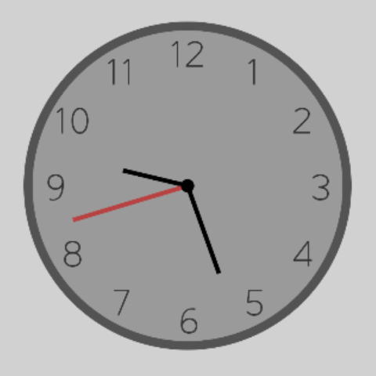
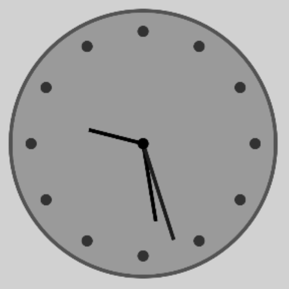
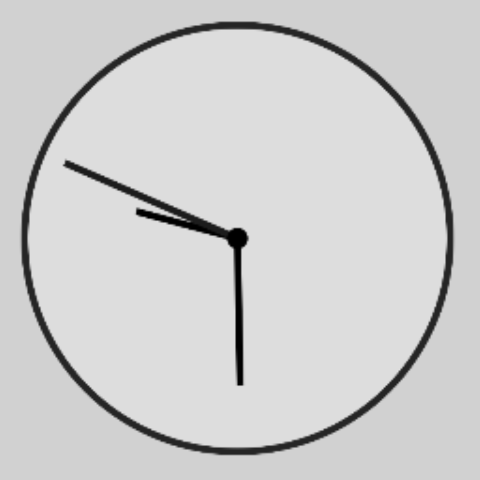
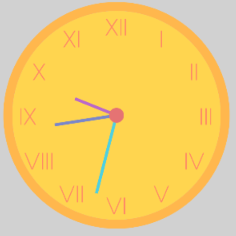

# Аналоговые часы

Custom view, позволяющее создавать аналоговые часы.

 

 

## Возможности

* Различные типы циферблата (цифры, римские цифры, круги, без циферблата).
* Настраиваемый размер циферблата, стрелок и границы.
* Настраиваемая толщина и цвет циферблата, стрелок и границы.
* Настраиваемый шрифт для текста на циферблате.
* Автоматическое обновление времени.

## Использование

Чтобы добавить AnalogClock в макет, добавьте код в xml файл макета:

```html

<com.example.AnalogClock
        android:layout_width="match_parent"
        android:layout_height="match_parent"
        android:id="@+id/clock"/>
```

## Поддерживаются следующие настройки:

| Название атрибута   |                 Тип значения                 |                              Описание |
|---------------------|:--------------------------------------------:|--------------------------------------:|
| dialType            | enum  (NUMBERS, ROMAN_NUMBERS, CIRCLE, NONE) |             Тип делений на циферблате |
| dialRadiusOrbit     |                    float                     |                     Радиус циферблата |
| dialElementSize     |                    float                     |     Размер элемента циферблата (Цифр) |
| dialColor           |                    color                     |                  Цвет цифр циферблата |
| dialTextFont        |         string (путь до font asset)          |                 Шрифт цифр циферблата |
| centerRadiusOrbit   |                    float                     |             Размер центрального круга |
| centerColor         |                    float                     |               Цвет центрального круга |
| borderColor         |                    float                     |                          Цвет границы |
| borderThickness     |                    float                     |                       Толщина границы |
| borderOffset        |                    float                     |     Отступ границы от края циферблата |
| backgroundColor     |                    color                     |                             Цвет фона |
| hourHandColor       |                    color                     |                  Цвет часовой стрелки |
| hourHandThickness   |                    float                     |               Толщина часовой стрелки |
| hourHandSize        |               float (0.0-1.0)                |   Относительная длина часовой стрелки |
| minuteHandColor     |                    color                     |                 Цвет минутной стрелки |
| minuteHandThickness |                    float                     |              Толщина минутной стрелки |
| minuteHandSize      |               float (0.0-1.0)                |  Относительная длина минутной стрелки |
| secondHandColor     |                    color                     |                Цвет секундной стрелки |
| secondHandThickness |                    float                     |             Толщина секундной стрелки |
| secondHandSize      |               float (0.0-1.0)                | Относительная длина секундной стрелки |
| delayUpdate         |                    float                     |      Задержка обновления времени (мс) |
